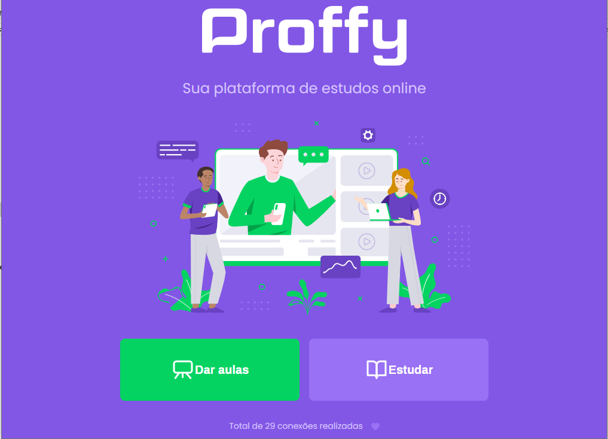
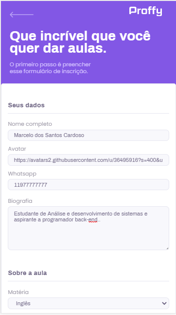

# Proffy 
## Descrição :scroll:
Fron-end de uma plataforma de ensino on-line que conecta alunos e professores criada durante a Next Level Week #2 :rocket:.
## Índice 📌 
  - Pré-requisitos e como rodar a aplicação
  - Features
  - Tecnologias
  - Screenshots
## Status do Projeto :warning:
:construction: Em construção :construction:
## Pré-requisitos e como rodar a aplicação :memo:
### Pré-requisitos :heavy_check_mark:
  * [Node.js](https://nodejs.org/en/) 
  * [Git](https://git-scm.com)
  * Yarn (opcional)
### Como rodar :interrobang:
  * Baixe o projeto com 'git clone https://github.com/marceloSantosC/Proffy' (sem aspas)
  * Abra o terminal na pasta raiz do projeto
  * Instale as dependências com 'npm install' ou 'yarn install' (sem aspas)
  * Inicie a aplicação com 'yarn start' ou 'npm run start' (sem aspas)
  * Digite o endereço "http://localhost:3000/" no navegador
## Features✅ 
- [x] Contador de conexões entre professores e alunos
- [x] Layout responsivo
- [x] Cadastro de professores 
- [x] Horários personalizados para professores
- [x] Filtrar professores por matéria, dia das aulas (dia da semana) e horário
## 🛠 Tecnologias
  -  React
  -  React Native
  -  TypeScript
  -  NodeJs
  -  Expo
  -  Sqlite
## Screenshots :camera:
### Página de início do desktop :house:

### Página de início mobile (360x640) :house:

### Cadastrar professor :open_file_folder:

### Buscar professor :mag:

  
